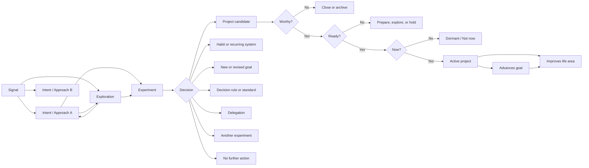

# Signal-to-Commitment System — Version 1

## 1. What the system is
This is a **personal opportunity-discovery and commitment-selection system**.

It helps you:

- Capture things that may deserve attention without treating them as obligations.
- Consider multiple possible ways of responding.
- Explore unclear territory without prematurely committing.
- Test important assumptions through bounded experiments.
- Decide what deserves further investment.
- Transition only sufficiently valuable, understood, aligned, and timely work into active projects.
- Keep the majority of ideas dormant or closed without guilt.
Its central question is:

> **What deserves more of my limited time, attention, effort, and money—and what should remain only a possibility?**

Its purpose is not to maximize the number of signals that become projects. Its purpose is to improve the quality of commitments you choose.


---


# 2. Core terminology

## Signal
A **signal** is something you notice that may deserve attention.

It may be:

- A problem.
- An opportunity.
- A recurring frustration.
- A need.
- A desire.
- A possibility.
- A concern.
- A pattern.
- An observation.
- A question.
- A potentially valuable improvement.
A signal is not necessarily a solution and does not create an obligation.

> “Something about this situation may be worth understanding or doing something about.”

Example:

> “I regularly have useful thoughts, but capture friction causes me to forget them.”

That is a signal.

“Build a voice-capture app” is not the signal. It is one possible approach to the signal.


---


## Intent / Approach
An **intent**, also called an **approach**, is one possible direction for responding to a signal.

One signal may produce many intents.

For example:

**Signal:** I forget useful ideas because capturing them is inconvenient.

**Possible intents or approaches:**

- Use an existing voice-note application.
- Create a one-tap phone shortcut.
- Build a voice-first capture application.
- Create a physical capture device.
- Improve the habit of reviewing captured notes.
- Decide that most fleeting ideas are not worth preserving.
A useful intent statement is:

> **By trying this approach, I expect this change, because I currently believe this assumption.**

For example:

> By using one-tap voice capture, I expect to retain more useful ideas, because I believe typing friction is the main reason I fail to capture them.

The assumption is important because it indicates what may eventually need to be tested.


---


## Exploration
An **exploration** is a small, bounded investigation used when the signal or approach is still too unclear to form a useful hypothesis.

The exploration statement is:

> I do not yet understand this well enough to form a testable assumption, so I will spend a small, fixed amount of time investigating it.

Exploration is not unrestricted research. It must have:

- A specific area of uncertainty.
- A fixed time, money, or attention budget.
- An end date or stopping point.
- A defined output.
A successful exploration should produce at least one of the following:

- A clearer signal.
- One or more plausible intents.
- A testable assumption.
- A possible experiment.
- Enough understanding to decide no further action is needed.
- Evidence that an existing solution is already sufficient.

### Exploration exit rule
> Stop exploring when you can state a meaningful assumption to test, choose a clearer approach, or confidently close the matter.

Exploration should not become a permanent state.


---


## Experiment
An **experiment** is a bounded attempt to reduce an important uncertainty so that a decision can be made.

An experiment does not require a final delivery goal. It requires a **decision goal**.

> An experiment succeeds when it produces enough evidence to make a better decision—not when it proves that the original idea was correct.

A negative result can therefore be a successful experiment.


---


## Project candidate
A **project candidate** is a possible finite commitment that appears valuable enough to consider, but has not yet been activated.

It may already be worthy without being ready.

It may be ready without being the right thing to start now.

A project candidate should not consume active execution capacity until it passes the project activation gates.


---


## Active project
An **active project** is a finite, explicitly chosen commitment with:

- A clearly defined outcome.
- Acceptance criteria.
- Primary alignment.
- A relevant deadline or review date.
- An explicit place in your current capacity.
- A current milestone or next action.
An active project is not merely something important.

> **Active means currently funded with time and attention.**


---


## Goal
A **goal** describes a meaningful change you want to create, usually within a defined time period.

Example:

> Build a backend-engineering portfolio strong enough to support a role change by December.

A goal concerns a desired result.

It is not a list of tasks.


---


## Life area
A **life area** is an ongoing part of life that must be maintained or improved over time.

Examples:

- Health.
- Career.
- Finances.
- Relationships.
- Home.
- Personal growth.
- Recreation.
- Creativity.
Areas do not finish.

Projects may finish. Goals may be achieved. Areas continue indefinitely.


---


## Habit or recurring system
A **habit or recurring system** represents something that must happen repeatedly.

Examples:

- Exercising four times per week.
- Reviewing finances monthly.
- Conducting a weekly planning review.
- Backing up important files.
- Staying in touch with family.
Recurring work should not be forced into the project model.

A project may create or improve a recurring system:

> Project: Design and establish a sustainable weekly exercise routine.

Once the project is completed, the resulting recurring activity is managed as a habit or system:

> System: Exercise four times per week.

Version 1 represents habits and systems, but does not attempt to become a complete habit tracker.


---


# 3. Core design principles

## 3.1 Capture is not commitment
Recording a signal means:

> “This may be worth remembering.”

It does not mean:

> “I have agreed to work on this.”

This distinction prevents the signal inbox from becoming a backlog of psychological debt.


---


## 3.2 Commitment should increase gradually
The information and evidence required should grow with the amount of investment.

```
Signal                Very low commitment
Intent / Approach     Low commitment
Exploration           Small bounded investment
Experiment            Bounded evidence-seeking investment
Project candidate     Evaluated potential commitment
Active project        Serious execution commitment
```

A raw signal should remain lightweight.

An active project should be precise.


---


## 3.3 Use transitions, not promotions
Movement between stages is called a **transition**, not a promotion.

“Promotion” implies that later stages are inherently better.

They are not.

A signal that is rejected after a one-hour exploration may have moved through the system perfectly. An experiment that prevents six months of wasted effort may be more successful than one that creates a project.

Valid transitions include:

- Moving forward.
- Returning to exploration.
- Changing the approach.
- Combining related signals.
- Splitting one signal into several.
- Becoming dormant.
- Being delegated.
- Becoming a habit.
- Being rejected.
- Being archived.
- Producing no further action.
The system rewards **cheap rejection and decisive closure**, not advancement for its own sake.


---


## 3.4 The default is “not now”
The normal fate of a signal is not to become an active project.

Most signals should remain:

- Dormant.
- Unexplored.
- Archived.
- Rejected.
- Available for later reconsideration.
A healthy system should contain many signals, fewer intents, very few active experiments, and only a small number of active projects.


---


## 3.5 Evidence informs commitment; it does not automatically create commitment
An experiment may prove that an outcome is valuable.

That does not mean the corresponding project should immediately become active.

Evidence answers:

> “Does this appear worth doing?”

Portfolio selection answers:

> “Should I do it now rather than something else?”

Those are separate decisions.


---


## 3.6 The system is a graph, not a pipeline
The stages provide useful concepts, but the underlying structure is not a one-way sequence.

For example:

- One signal may produce several intents.
- Several signals may converge into one approach.
- One intent may require several experiments.
- One experiment may reveal a different signal.
- One experiment may inform several related approaches.
- Several experiments may support one project candidate.
- A project may reveal new signals.
- A project may create a recurring system.
- A project may stop being aligned and return to candidate status.
- A dormant signal may become relevant because a goal or life condition changes.
The system should therefore store relationships, not merely columns on a board.


---


# 4. The conceptual graph
```

```

This is only one view of the graph. It is not a compulsory path.

A known obligation may enter directly as a project candidate. For example, filing taxes does not require an experiment to determine whether it is worth doing.

Likewise, an intent may move directly into an experiment when the assumption is already clear, without requiring a separate exploration.

The stages are tools, not mandatory ceremonies.


---


# 5. Choosing an experiment’s decision goal
The decision goal needs a simple rule. The recommended rule is:


## The Next-Commitment Rule
> **Test the uncertainty behind the next meaningful commitment—not whether the entire idea is good.**

Use four steps.


### Step 1: Identify the next commitment
Ask:

> What meaningful investment would I make next if the evidence were encouraging?

Examples:

- Spend another afternoon researching.
- Use a workflow for two weeks.
- Purchase a tool.
- Build a prototype.
- Commit four weekends to an MVP.
- Adopt a recurring habit.
- Ask someone else to participate.
- Start a formal project.
The next commitment should be concrete.


---


### Step 2: Identify the critical uncertainty
Ask:

> Which single assumption, if false, would make that next commitment a poor use of time, attention, or money?

Choose an assumption that is both:

- **Uncertain:** You do not already have reliable evidence.
- **Consequential:** If it is false, your next commitment would probably be a mistake.
Do not test ten assumptions at once.

> **One experiment, one decision, one critical uncertainty.**


---


### Step 3: Decide what evidence would be enough
Ask:

> What is the minimum observable evidence that would make the next commitment rational rather than merely exciting?

The threshold does not need to be scientifically perfect. It needs to be explicit enough to prevent you from interpreting any result as validation.

Examples:

- I experience the problem at least five times in one week.
- I use the workaround on at least ten of fourteen days.
- At least three captured items create later value.
- Three relevant users independently describe the same problem.
- A manual version saves at least thirty minutes per week.
- I remain interested after the novelty of the first week fades.


---


### Step 4: Write the decision goal
Use this template:

> **By the end of** **[time or budget]****, determine whether to** **[continue, change, stop, defer, delegate, or transition]** **this approach by testing whether** **[critical assumption]** **is supported by** **[observable evidence]****.**

Example:

> Over fourteen days, determine whether to invest four weekends in building a voice-capture MVP by testing whether I use a manual one-tap workflow on at least ten days and later retrieve at least three captured items that prove useful.

This experiment is not trying to determine whether the entire product should exist.

It is determining whether the **next larger investment** is justified.


---


## Experiment decision outcomes
Every experiment should end with one of four decision categories:


### Continue
The evidence supports additional investment.

Possible transition:

- Another experiment.
- A project candidate.
- A habit or system.
- Delegation.
- A new goal.

### Change
The signal remains important, but the tested approach or assumption was wrong.

Possible transition:

- Refine the current intent.
- Create a new intent.
- Conduct another exploration.
- Design a different experiment.

### Stop
The signal, approach, or expected value does not justify additional investment.

Possible transition:

- Reject.
- Archive.
- Record a decision rule.
- Take no further action.

### Hold
The opportunity may remain valuable, but conditions do not support action now.

Possible transition:

- Dormant.
- Waiting for a trigger.
- Revisit on a defined date.
- Reconsider when capacity, technology, money, or circumstances change.


---


# 6. Project activation: Worthy, Ready, and Now
An experiment that supports a project should normally create a **project candidate**, not an active project.

The project candidate must pass three distinct judgments.


## 6.1 Worthy
> Would the outcome create enough meaningful value to justify serious consideration?

Worthy considers:

- Primary goal or area alignment.
- Expected benefit.
- Problem importance.
- Risk reduced.
- Capability created.
- Evidence collected.
- Whether an existing solution already provides enough value.
- Whether the outcome is meaningful to you, not merely interesting.
Alignment is part of worthiness.

A technically interesting project with no meaningful contribution may be enjoyable, but it should not be disguised as a strategic commitment.

It may instead belong to a deliberately limited curiosity or play allocation.


---


## 6.2 Ready
> Is the project understood well enough to begin responsibly?

A project is ready when you can state:

- The finite desired outcome.
- Acceptance criteria.
- Primary alignment.
- Major constraints.
- Important dependencies.
- A rough effort or lead-time estimate.
- The first milestone or concrete action.
- The major remaining risks.
Ready does not mean every detail is known.

It means uncertainty has been reduced enough that activation is not merely speculative.

A worthy but unready project may transition back to:

- Exploration.
- Experimentation.
- Preparation.
- Dependency resolution.
- Dormancy.


---


## 6.3 Now
> Does this project deserve one of my current project slots more than the available alternatives?

“Now” considers:

- Current capacity.
- Work-in-progress limits.
- Goal timing.
- Consequence of delay.
- Opportunity windows.
- Critical-path dependencies.
- Competing project candidates.
- Current life-area condition.
- Attention and energy requirements.
- What must be delayed or stopped to make room.
A project may be worthy and ready but still receive a “not now” decision.

That is not rejection. It becomes a dormant project candidate.


---


## The activation rule
A project becomes active only when:

```
Worthy = Yes
Ready  = Yes
Now    = Yes
Capacity slot = Available
```

Starting a new major project should require:

- Completing another major project.
- Cancelling another major project.
- Explicitly pausing another major project.
- Or consciously increasing capacity with an understood cost.


---


# 7. Goals, projects, areas, and recurring systems
These concepts should remain structurally distinct.

| Concept | Meaning | Completion condition |
| --- | --- | --- |
| **Area** | An ongoing part of life that must remain healthy | Never permanently completed |
| **Goal** | A desired change within a timeframe | Desired condition or result is achieved |
| **Project** | Finite work producing a defined outcome | Acceptance criteria are met |
| **Habit/System** | Repeated behaviour or ongoing standard | Maintained reliably over time |
| **Experiment** | A bounded test of uncertainty | A supported decision is reached |
| **Exploration** | Bounded investigation before a hypothesis exists | Enough understanding to test, choose, or close |


## Example

### Area
Career.


### Goal
Become competitive for a backend platform-engineering role by December.


### Project
Publish a production-grade event-delivery platform with deployment, observability, documentation, and a public case study.


### Habit or system
Spend two focused sessions per week maintaining technical learning and portfolio progress.


### Experiment
Determine whether an event-delivery platform demonstrates the right capabilities by obtaining feedback from three experienced backend engineers before committing to the full build.

Each serves a different purpose.


---


# 8. Alignment rules

## Every project has one primary alignment
A project should have one primary alignment.

It may have several secondary benefits, but those secondary benefits should not obscure why the project exists.

Example:

> **Primary alignment:** Career goal—demonstrate distributed-systems competence.
> **Secondary benefit:** Learning area—improve Kubernetes operations knowledge.

The primary alignment determines:

- Why the project exists.
- How its value is evaluated.
- What should happen if the goal changes.
- Which competing projects it should be compared with.


---


## Projects without an explicit goal
A project may still be valid without an explicit goal, but it must make a concrete contribution to an important life area.

Valid area-level contributions include:

- Restoring an area that is below its minimum acceptable condition.
- Reducing a meaningful risk.
- Removing persistent friction.
- Building a clearly named capability.
- Preventing deterioration.
- Establishing an important recurring system.
- Meeting an unavoidable obligation.
Weak justification:

> “This supports personal growth.”

Stronger justification:

> “This project establishes a reliable monthly financial review system, reducing the risk of missed payments and unmonitored spending in the finances area.”

Broad labels alone are not alignment.

The causal contribution should be explicit.


---


# 9. Life-area guardrails
Projects should not compete through one global numerical score.

Some areas require minimum protection regardless of how valuable another project appears.


## Area floor
Each important area should have a **minimum acceptable standard**, or floor.

Examples:


### Health
- Minimum sleep standard.
- Essential medical care.
- Basic movement.
- Minimum recovery time.

### Finances
- Bills paid.
- Emergency obligations covered.
- No preventable high-interest debt growth.

### Relationships
- Important commitments honoured.
- Minimum meaningful contact.
- No sustained neglect caused by discretionary work.

### Career
- Core job responsibilities delivered.
- Required learning or compliance maintained.
The floors do not need to be perfectly quantified. They need to be concrete enough to notice when an area is being sacrificed.


---


## Guardrail rule
> A discretionary project should not be activated when doing so would predictably push an important life area below its minimum floor.

Exceptions may exist for emergencies or short, conscious trade-offs, but the override should be explicit and time-bounded.

This prevents a high-value career project from silently consuming health, relationships, or financial stability.


---


## Growth areas
At any given time, some areas may remain in maintenance mode while a small number receive additional growth investment.

Recommended starting limit:

- One or two areas in active growth mode.
- All other areas maintained above their floors.
- Any area below its floor temporarily becomes a recovery priority.
This prevents simultaneous attempts to transform every part of life.


---


# 10. Project urgency and priority
Deadline proximity alone does not determine urgency.

> **Urgency is the consequence of delaying work now, not merely how close the deadline appears.**

A project due in six months may be more urgent than one due next week if the first requires five months of lead time and the second requires one hour.


## Latest sensible start
A useful planning concept is:

```
Latest sensible start
=
Goal deadline
− Realistic project lead time
− Dependency time
− Safety buffer
```

Urgency increases when:

- The present date approaches the latest sensible start.
- Delaying one review cycle would consume important slack.
- A dependency must begin before later work can happen.
- An opportunity window may close.
- Delay increases cost, risk, or difficulty.
- Recovery becomes more difficult with time.
- The project sits on the critical path of a goal.


---


## Priority order
Rather than reducing everything to one numerical score, apply decisions in this order.


### 1. Protect area floors and non-negotiable obligations
Work required for health, safety, finances, legal obligations, or core responsibilities comes first.


### 2. Identify critical-path and delay-sensitive work
Ask:

> What becomes materially harder, riskier, more expensive, or impossible if delayed now?


### 3. Evaluate goal contribution
Ask:

> How directly does this project move the primary goal?

A project that merely feels related to a goal should rank below one with a clear causal contribution.


### 4. Evaluate leverage and risk reduction
Ask:

- Does this unblock several later activities?
- Does it create a reusable asset or capability?
- Does it remove a recurring bottleneck?
- Does it reduce a major uncertainty or risk?

### 5. Consider evidence and confidence
A project supported by evidence should generally outrank an equally valuable project based mainly on speculation.


### 6. Consider effort, attention, and opportunity cost
Ask:

> What will this displace?

A project is not cheap merely because it requires few calendar hours. It may require substantial cognitive switching, emotional energy, or long-term maintenance.


---


## Pairwise priority question
When two candidates compete, ask:

> If I can activate only one of these during the next review period, which delay creates the larger real consequence?

This is usually more reliable than assigning arbitrary scores to everything.


---


# 11. Experiment destinations
An experiment does not exist solely to create a project.

It may transition into:

```
Experiment
 ├─ Project candidate
 ├─ Habit or recurring system
 ├─ New or revised goal
 ├─ Decision rule or standard
 ├─ Delegation
 ├─ Refined intent
 ├─ Another experiment
 ├─ Dormant / Not now
 └─ No further action
```


## Examples

### Habit or system
An experiment shows that a five-minute evening review solves the idea-retrieval problem without new software.


### Decision rule
An experiment establishes:

> Do not build a custom tool unless an existing workflow has been used consistently for at least fourteen days and a specific unresolved limitation remains.


### Delegation
The problem is real, but another person or service is better positioned to solve it.


### Revised goal
The experiment reveals that the desired outcome is different from what you originally believed.


### No further action
The problem occurs too rarely to justify continued attention.

All of these are valid outcomes.


---


# 12. Attention states are separate from entity types
The **type** of an item answers:

> What kind of thing is this?

Examples:

- Signal.
- Intent.
- Exploration.
- Experiment.
- Project candidate.
- Project.
- Goal.
- Habit.
The **attention state** answers:

> What am I currently doing with it?

Recommended attention states:

| State | Meaning |
| --- | --- |
| **Inbox** | Captured but not yet reviewed |
| **Active** | Currently receiving time and attention |
| **Waiting** | Blocked by an external condition or dependency |
| **Dormant** | Potentially relevant, but intentionally receiving no attention |
| **Closed** | Completed, rejected, archived, or otherwise concluded |

This separation is important.

A project candidate may be dormant. An experiment may be waiting. A signal may be closed. A project may be active.

The entity type should not itself imply current priority.


---


# 13. Dormant, rejected, and archived
These should be distinct enough to support clear decisions.


## Dormant
> Still potentially valuable, but not receiving attention now.

A significant dormant item may include:

- Why it is not active.
- A revisit date.
- A trigger that would make it relevant.
- What would need to change.
Example:

> Revisit when current portfolio project is completed or when voice transcription becomes available offline.

Raw signals do not all require scheduled reminders.


---


## Rejected
> Evidence or reasoning indicates that the approach is not worth further investment under current assumptions.

A rejected item should retain a short reason so that the same idea is not repeatedly reconsidered without new evidence.


---


## Archived
> Preserved for history or reference, but no longer part of active decision-making.

Archive is appropriate when:

- The context has expired.
- The signal no longer matters.
- The information remains useful but does not require action.
- The matter was superseded by another approach.


---


# 14. Work-in-progress limits
Without limits, the framework becomes an organized collection rather than a commitment system.

Recommended starting defaults:

| Category | Starting limit |
| --- | --- |
| Active explorations | 1–2 |
| Active experiments | 1–2 |
| Active major projects | 1 |
| Active minor finite projects | 2 |
| Life areas in growth mode | 1–2 |

These are starting limits, not universal laws.

The important rule is:

> Every active item must occupy a scarce slot.

A slot should not be created merely by labeling something “small.” Repeated small commitments can collectively consume more attention than one major project.

When a limit is reached, a new item requires an explicit replacement decision.


---


# 15. Review cadence
Version 1 requires a lightweight review loop but does not attempt to become a complete project-execution or planning system.


## During the day: capture
Capture signals with minimal friction.

Do not require:

- Categorisation.
- Scoring.
- Goal assignment.
- Full context.
- An intent.
- An immediate decision.
Minimum capture:

- What did I notice?
- Any context that would otherwise be forgotten.


---


## Weekly: clarify and decide
The weekly review should cover:

- Unprocessed signals.
- Signals that appear to deserve an intent.
- Active explorations and their remaining budget.
- Experiments approaching their decision date.
- Experiments that need closure.
- Dormant candidates whose trigger occurred.
- Active project WIP limits.
- Whether any project candidate deserves activation.
- Whether anything should be closed, changed, or held.
The weekly review is primarily a **transition review**.

Its purpose is not to admire the backlog. It is to make decisions.


---


## Monthly: portfolio and alignment review
The monthly review should cover:

- Current goals and their timelines.
- Goal progress.
- Latest sensible start dates.
- Active projects and their primary alignment.
- Stale project candidates.
- Life-area floors.
- Areas currently in growth mode.
- Whether current projects are damaging another area.
- Whether active commitments still deserve their slots.
- Whether any dormant candidate has become more urgent.
- Whether any project should be paused or cancelled.
The monthly review is primarily a **portfolio review**.


---


# 16. Minimum information required at each stage
Information requirements should increase as commitment increases.


## Signal
Required:

- What did I notice?
- Why did it stand out, if immediately clear?
- Relevant context, source, or situation.
Not required:

- Category.
- Goal.
- Solution.
- Priority.
- Next action.


---


## Intent / Approach
Required:

- The proposed direction.
- The expected change.
- The important assumption.
Template:

> By trying **[approach]**, I expect **[change]**, because I believe **[assumption]**.


---


## Exploration
Required:

- What is currently unclear?
- What will be investigated?
- Time, money, or attention budget.
- End date or stopping condition.
- Expected output.
Template:

> I need to understand **[unknown]**. I will spend **[budget]** investigating **[scope]**, after which I will either define an intent, formulate an experiment, or close the matter.


---


## Experiment
Required:

- Decision goal.
- Next commitment being evaluated.
- Critical assumption.
- Test method.
- Observable evidence or threshold.
- Time or resource budget.
- Decision date.
- Final decision and reasoning.
Template:

> By **[date/budget]**, decide whether to **[continue/change/stop/hold/transition]** by testing whether **[assumption]** is supported by **[evidence]**.


---


## Project candidate
Required:

- Proposed finite outcome.
- Evidence supporting its value.
- Primary alignment.
- Draft acceptance criteria.
- Major constraints and dependencies.
- Rough effort or lead time.
- Worthy assessment.
- Ready assessment.
- Now assessment.


---


## Active project
Required:

- Final desired outcome.
- Acceptance criteria.
- Primary goal or area alignment.
- Deadline or review date.
- Realistic lead time.
- Current milestone.
- Next concrete action.
- Major dependency or blocker.
- Assigned project slot.
Detailed task execution is deferred from Version 1 and may happen in a dedicated task or project-management tool.


---


## Goal
Required:

- Desired change.
- Life area.
- Target date or review period.
- Success condition.
- Why it matters.


---


## Life area
Required:

- Area definition.
- Minimum acceptable floor.
- Current mode: maintenance or growth.
- Any known risk or deterioration.


---


## Habit or recurring system
Version 1 stores only:

- The repeated behaviour or maintained standard.
- Relevant life area.
- Intended cadence or trigger.
- Why it exists.
Detailed streaks, adherence tracking, reminders, and behavioural design are deferred.


---


# 17. Transition records
Every meaningful transition should retain a short history.

Recommended transition record:

- Previous type or state.
- New type or state.
- Date.
- Reason.
- Supporting evidence, when relevant.
Examples:

> Experiment → Project candidate
> Reason: The manual workflow was used on 12 of 14 days and produced five useful later retrievals.

> Project candidate → Dormant
> Reason: Worthy and ready, but lower priority than current portfolio project. Revisit after project completion.

> Intent → Rejected
> Reason: Existing tool already solves the problem sufficiently; custom development would not create enough additional value.

This history prevents repeatedly reopening settled decisions without new evidence.


---


# 18. Version 1 boundaries

## Included in Version 1
Version 1 handles:

- Frictionless signal capture.
- Signal clarification.
- Multiple intents or approaches.
- Bounded exploration.
- Evidence-oriented experiments.
- Decision goals.
- Experiment outcomes.
- Project-candidate creation.
- Worthy, Ready, and Now evaluations.
- Goal and life-area alignment.
- Primary and secondary alignment.
- Life-area guardrails.
- Basic urgency reasoning.
- Dormancy and closure.
- Work-in-progress limits.
- Lightweight weekly and monthly reviews.
- Basic representation of recurring systems.
- Graph relationships and transition history.


---


## Deferred to later versions
The following are intentionally deferred:

- Detailed project task management.
- Complex milestone and dependency planning.
- Full calendar and scheduling integration.
- Advanced capacity forecasting.
- Energy-based workload planning.
- Detailed habit tracking.
- Streaks, reminders, and behavioural analytics.
- Complete goal-setting methodology.
- Automatic numerical scoring.
- AI-generated priority decisions.
- Portfolio simulations.
- Advanced analytics and performance metrics.
- Team collaboration and multi-user ownership.
- Full execution dashboards.
Version 1 should decide **what deserves commitment** and then hand active execution to an existing project or task-management system.

It should not attempt to solve every aspect of personal productivity immediately.


---


# 19. Canonical operating rules
The updated system can be summarized through these rules:

1. **Capture signals cheaply.**
2. **A signal is not a commitment.**
3. **One signal may have multiple intents or approaches.**
4. **Explore only when you cannot yet form a useful assumption.**
5. **Every exploration has a fixed budget and exit condition.**
6. **One experiment should support one important decision.**
7. **Test the critical uncertainty behind the next meaningful commitment.**
8. **Every experiment has a decision date.**
9. **Transitions can move forward, backward, sideways, dormant, or closed.**
10. **Closure is a successful outcome when it prevents misplaced investment.**
11. **A successful experiment creates a decision, not automatically a project.**
12. **A potential project first becomes a project candidate.**
13. **Only candidates that are Worthy, Ready, and Now become active projects.**
14. **Every active item consumes a scarce work-in-progress slot.**
15. **Starting something new requires an explicit capacity decision.**
16. **Every project has one primary alignment.**
17. **Secondary benefits do not replace primary justification.**
18. **Areas, goals, projects, experiments, and recurring systems remain distinct.**
19. **Life-area floors are protected before discretionary projects are ranked.**
20. **Urgency is based on the consequence of delaying now and remaining slack, not deadline proximity alone.**
21. **The default state of most signals and candidates is dormant, not active.**
22. **The underlying structure is a graph, not a one-way pipeline.**
23. **Information requirements increase with the level of commitment.**
24. **Every important transition preserves a short reason and supporting evidence.**


---


# Final formulation
The updated system is not designed to turn every signal into work.

It is designed to let signals remain inexpensive, let exploration create understanding, let experiments create evidence, and let project candidates remain dormant until they are:

- **Worthy** enough to matter.
- **Ready** enough to execute.
- **Aligned** strongly enough to justify themselves.
- **Timely** enough that delaying has a meaningful cost.
- **Capacity-backed** enough to receive real attention.
- **More valuable than what they must displace.**
That is the central operating philosophy of Version 1.

